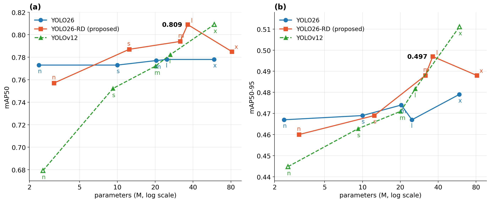
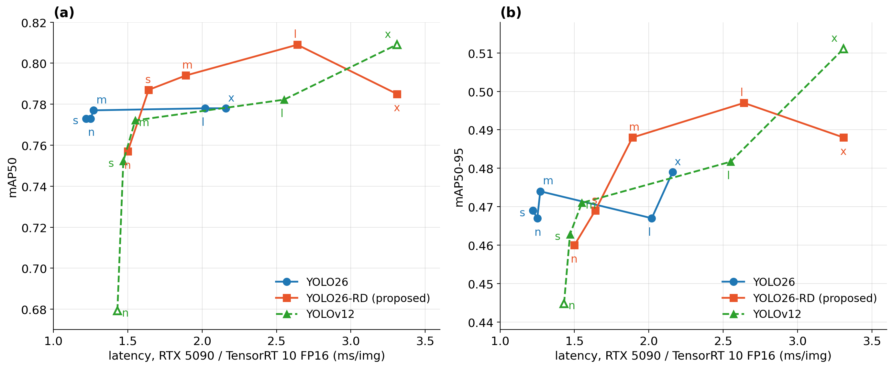

# YOLO26-RD: NMS-Free Road-Damage Detection

An end-to-end (NMS-free) object detector for pavement distress — **alligator cracking, linear
cracks, and patching** — built on YOLO26 and revised by a data audit of real road-survey imagery.

YOLO26-RD keeps the high-resolution P2/4 branch as a **feature** path fused into the neck, but
**removes the P2 detection level** (Detect(P3, P4, P5)): on region-annotated survey imagery only
~1.4% of instances are COCO-small at 640², so a stride-4 detection level would spend 75% of all
anchors where almost no ground truth lives. Two lightweight modules complete the design:

- **LearnableContrast** (494 parameters) — a differentiable, per-tile analogue of CLAHE: local
  gamma/gain predicted from tile statistics, bilinearly blended, zero-initialized to identity,
  active at inference.
- **EdgeSPD** (+2 parameters over SPD-Conv) — Sobel-gated lossless space-to-depth downsampling at
  the P3 and P4 transitions.

This repository is a fork of Ultralytics 8.4.115 with both modules built in — a stock
`pip install ultralytics` will **not** load these models.

## Pavement damage detection results

Full scale sweep on the 7,618-image road-survey dataset (3 classes: alligator cracking, linear
cracks, patching). All three families were trained **from scratch** with the identical recipe
(640², 120 epochs, MuSGD, `mosaic=0.5`, `close_mosaic=30`, `flipud=0.5`, `cos_lr`), and every number
below is the fitness-selected `best.pt` evaluated on the validation split.

### Accuracy vs. model size



*(a) mAP50 and (b) mAP50-95 against parameter count (log scale). YOLO26-RD-l reaches **0.809 mAP50 /
0.497 mAP50-95** — the best accuracy-per-parameter point in the sweep.*

| scale | YOLO26 (base) | YOLO26-RD (proposed) | YOLOv12 |
|---|---|---|---|
| n | 0.773 / 0.467 | 0.757 / 0.460 | 0.680 / 0.445 |
| s | 0.773 / 0.469 | **0.787** / 0.469 | 0.752 / 0.463 |
| m | 0.777 / 0.474 | **0.794 / 0.488** | 0.772 / 0.471 |
| l | 0.778 / 0.467 | **0.809 / 0.497** | 0.782 / 0.482 |
| x | 0.778 / 0.479 | 0.785 / 0.488 | **0.809 / 0.512** |

*val mAP50 / mAP50-95; best per row in bold.*

### Accuracy vs. latency



*Same checkpoints plotted against measured TensorRT FP16 inference time (640², batch 1, RTX 5090,
TensorRT 10.16).*

| scale | YOLO26 (base) | YOLO26-RD | YOLOv12 |
|---|---:|---:|---:|
| n | 1.26 | 1.50 | 1.44 |
| s | 1.22 | 1.64 | 1.46 |
| m | 1.27 | 1.89 | 1.55 |
| l | 2.02 | 2.64 | 2.55 |
| x | 2.16 | 3.31 | 3.30 |

*ms/image, inference only (no NMS for the `end2end` YOLO26/YOLO26-RD heads).*

### What the sweep shows

- **The base YOLO26 family saturates on this data.** mAP50 moves from 0.773 (n) to 0.778 (x) — a
  0.5-point spread over a 25× parameter increase. Capacity is not the binding constraint; the
  detection-level allocation and the low-contrast input are.
- **YOLO26-RD scales where the base model does not.** From `s` upward it is ahead of both baselines
  at matched scale, peaking at **0.809 / 0.497** with `l` (36.2M parameters, 2.64 ms).
- **Best accuracy per unit cost.** YOLO26-RD-l matches YOLOv12-x on mAP50 (0.809) with ~40% fewer
  parameters (36.2M vs ~59M) and 20% lower latency (2.64 ms vs 3.30 ms). YOLO26-RD-s already
  beats every base YOLO26 scale, and every YOLOv12 scale up to `l`, at 1.64 ms.
- **YOLOv12-x wins the strict metric.** At the very top of the range YOLOv12-x is best on mAP50-95
  (0.512 vs 0.497), so if localisation quality matters more than throughput and 59M parameters are
  affordable, it remains competitive.
- **Do not use the `n` scale of YOLO26-RD.** It is the one configuration that loses to the base
  model (0.757 vs 0.773) — LearnableContrast and EdgeSPD need enough channel width downstream to
  pay for themselves. Prefer `s` as the small-model entry point.

## How to use

### 1. Install

```bash
git clone <this-repo-url>
cd YOLO26-RD
pip install -e .
python -c "from ultralytics.nn.modules import EdgeSPD, LearnableContrast; print('YOLO26-RD fork OK')"
```

### 2. Dataset

Standard YOLO detection layout with a `data.yaml`:

```yaml
path: /path/to/dataset
train: train/images
val: valid/images
test: test/images
nc: 3
names: ['alligator crack', 'crack', 'patching']
```

Edit `nc`/`names` for your classes; labels are normalized `class cx cy w h` lines in `*/labels/`.

### 3. Train

Pick a scale and train (batch sizes keep the effective optimizer batch at 64 via gradient
accumulation — do not "normalize" them across scales):

```bash
# n / s (batch 32)
yolo detect train model=models/yolo26s-rd.yaml data=data.yaml \
     imgsz=640 epochs=120 batch=32 mosaic=0.5 close_mosaic=30 flipud=0.5 cos_lr=True

# m / l (batch 16)
yolo detect train model=models/yolo26l-rd.yaml data=data.yaml \
     imgsz=640 epochs=120 batch=16 mosaic=0.5 close_mosaic=30 flipud=0.5 cos_lr=True

# x (batch 8)
yolo detect train model=models/yolo26x-rd.yaml data=data.yaml \
     imgsz=640 epochs=120 batch=8 mosaic=0.5 close_mosaic=30 flipud=0.5 cos_lr=True

# base-model comparison run (stock YOLO26, same recipe)
yolo detect train model=yolo26s.yaml data=data.yaml \
     imgsz=640 epochs=120 batch=32 mosaic=0.5 close_mosaic=30 flipud=0.5 cos_lr=True
```

Python API — recommended for top-down road imagery, where exact 90° rotation is label-preserving
and was the largest single gain we measured (+3.7 test mAP50 on the base model):

```python
import albumentations as A            # pip install albumentations
from ultralytics import YOLO

model = YOLO("models/yolo26s-rd.yaml")
model.train(data="data.yaml", imgsz=640, epochs=120, batch=32,
            mosaic=0.5, close_mosaic=30, flipud=0.5, cos_lr=True,
            augmentations=[A.RandomRotate90(p=0.5)])
```

Notes:
- A `.yaml` model trains **from scratch**; `pretrained=True` is inert. That is the intended regime
  for YOLO26-RD — its custom stem and downsamplers accept only ~39% of stock YOLO26 weights, so a
  warm start is not available.
- Resume with `yolo detect train resume model=.../weights/last.pt` (re-pass `augmentations=`).
- `best.pt` is selected on val mAP50-95; report it, not per-epoch peaks.

### 4. Validate / test

```bash
yolo detect val model=runs/detect/train/weights/best.pt data=data.yaml imgsz=640            # val
yolo detect val model=runs/detect/train/weights/best.pt data=data.yaml imgsz=640 split=test # test (report once)
```

Always evaluate at the training `imgsz` (evaluating a 640-trained model at 800/960 *reduces*
accuracy on this data). Test-time augmentation (`augment=True`) is a no-op for NMS-free `end2end`
models. Exported models need no NMS post-processing.

### 5. Inference

```bash
# CLI
yolo predict model=weights/best.pt source=path/to/images conf=0.25

# helper script — prints per-image detections and the speed breakdown
python predict_trt.py weights/best.pt path/to/images --conf 0.25 --save
```

Python API:

```python
from ultralytics import YOLO

model = YOLO("weights/best.pt")                  # or "weights/best.engine"
results = model.predict("image.jpg", imgsz=640, conf=0.25, device=0)

for r in results:
    for b in r.boxes:
        name = r.names[int(b.cls)]               # 'alligator crack' | 'crack' | 'patching'
        conf = float(b.conf)
        x1, y1, x2, y2 = b.xyxy[0].tolist()      # pixels in the ORIGINAL image, not 640x640
        print(name, round(conf, 2), (x1, y1, x2, y2))
```

`source=` accepts an image, folder, glob, video, URL, or webcam index. Add `save=True` for
annotated output, `save_txt=True` for YOLO-format labels. For long videos or large folders use
`stream=True` to iterate lazily instead of building all results in memory.

### 6. Export to TensorRT (FP16)

TensorRT gives roughly an **8-11x** speedup over eager PyTorch on the same GPU.

```bash
pip install -r requirements-tensorrt.txt

python export_tensorrt.py weights/best.pt                     # FP16, imgsz 640, batch 1
python export_tensorrt.py weights/best.pt --imgsz 640 --batch 8
python export_tensorrt.py weights/best.pt --int8 --data data.yaml
```

Equivalent one-liners:

```python
from ultralytics import YOLO
YOLO("weights/best.pt").export(format="engine", half=True, imgsz=640, device=0)
```
```bash
yolo export model=weights/best.pt format=engine half=True imgsz=640 device=0
```

Then run it exactly like a `.pt`:

```bash
python predict_trt.py weights/best.engine path/to/images
```

Export goes `.pt -> .onnx -> .engine` and takes ~40-60 s; the intermediate `.onnx` can be deleted.

**Four things to know about engines:**

1. **`task="detect"` is required** when loading an `.engine` in the Python API — a serialized
   engine carries no task metadata, so Ultralytics cannot infer it:
   ```python
   YOLO("best.engine", task="detect")
   ```
2. **`imgsz` and `batch` are baked in at build time.** Build separate engines if you need more
   than one input size or batch size.
3. **Engines are not portable.** They are compiled for the specific GPU architecture, TensorRT
   version and CUDA version used at build time. Re-export from the `.pt` on each target machine.
4. **Discard the first inference when timing** — the first call pays a one-off warmup cost
   (roughly 25 ms vs ~2 ms settled).

#### Measured TensorRT FP16 latency

640x640, batch 1, RTX 5090, TensorRT 10.16, released YOLO26-RD weights:

| model | params | preprocess | inference | postprocess | total | FPS |
|---|---:|---:|---:|---:|---:|---:|
| YOLO26-RD-n | 3.00M | 2.20 | 1.50 | 0.45 | 4.16 | 241 |
| YOLO26-RD-s | 11.93M | 2.24 | 1.64 | 0.36 | 4.24 | 236 |
| YOLO26-RD-m | 30.18M | 2.12 | 1.89 | 0.44 | 4.45 | 225 |
| YOLO26-RD-l | 34.78M | 2.17 | 2.64 | 0.35 | 5.16 | 194 |
| YOLO26-RD-x | 78.17M | 2.14 | 3.31 | 0.45 | 5.90 | 170 |

*(ms; stock YOLO26-s for reference: 1.22 ms inference)*

Two practical notes. **Postprocessing is only 0.35-0.45 ms** because the `end2end` head needs no
NMS. And **preprocessing costs more than inference** for every scale up to `m` — that is resizing
full-resolution source imagery down to 640, so feeding pre-resized 640x640 images is a larger win
than switching to a smaller model.

#### Export troubleshooting

| symptom | cause and fix |
|---|---|
| `CUDA driver version is insufficient for CUDA runtime version` (error 35) | `pip install tensorrt` resolved to a CUDA 13 build. Install `tensorrt-cu12` explicitly (or `tensorrt-cu13` if your driver supports CUDA 13). |
| `AttributeError: ... has no attribute 'EXPLICIT_BATCH'` | TensorRT 11 removed that flag. Pin `tensorrt-cu12>=10.0,<11.0`. |
| `ModuleNotFoundError: No module named 'onnxscript'` | The torch>=2.6 ONNX exporter needs it: `pip install onnxscript`. |
| `WARNING: ... requires precision-lose casting` | Harmless — TensorRT noting an FP16 cast, expected with `half=True`. |
| Engine fails to load on another machine | Engines are hardware/version specific. Re-export from the `.pt` there. |

### 7. Recommended recipe (evidence-based)

- `mosaic=0.5` with a generous `close_mosaic` — full mosaic truncates near-frame-size distress
  boxes and degraded long runs in our experiments.
- `flipud=0.5` and `A.RandomRotate90(p=0.5)` — top-down imagery has no canonical orientation;
  90° rotations are label-exact for axis-aligned boxes.
- Train and validate at the same `imgsz`.
- For class imbalance: duplicate rare-class images in a `train:` `.txt` list (duplicates are kept),
  or set `cls_pw` (inverse-frequency^cls_pw class weighting; 0.0 disables).

## Module reference

Both modules are registered in `ultralytics/nn/tasks.py` and usable in any model YAML:

```yaml
- [-1, 1, LearnableContrast, [3]]   # input stem; args: [channels, hidden_width, tile_grid]
- [-1, 1, EdgeSPD, [256, 3]]        # lossless downsample /2; args: [out_channels, fusion_kernel]
```

Implementation: `ultralytics/nn/modules/conv.py` (`EdgeSPD`, `LearnableContrast`).

## Citation

```bibtex
@article{youwai2026yolo26rd,
  title   = {YOLO26-RD: A Data-Audited, Contrast-Enhanced, Edge-Guided NMS-Free Detector
             for Road-Damage Detection},
  author  = {Youwai, Sompote and Chaipetch, Pawatorn Awarotorn},
  year    = {2026},
  note    = {Preprint}
}
```

## License

AGPL-3.0, inherited from the Ultralytics codebase this fork is built on.
